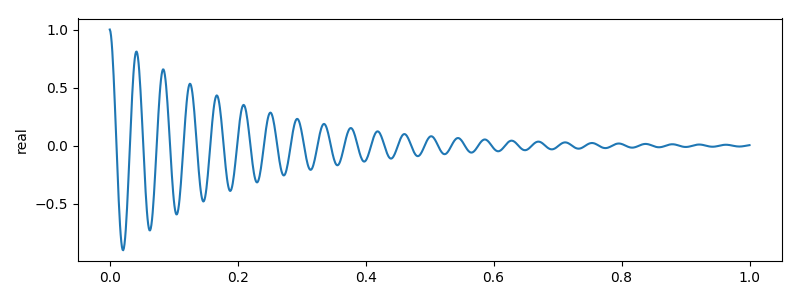
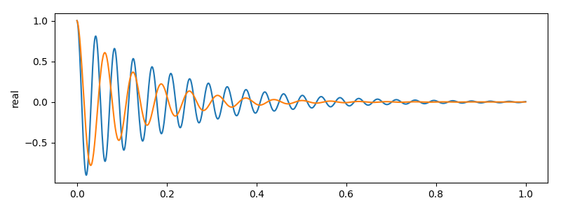
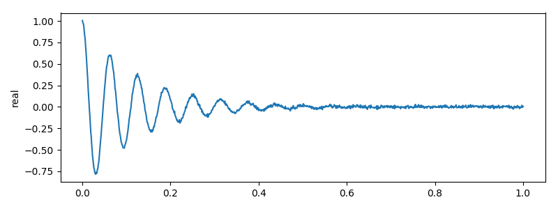
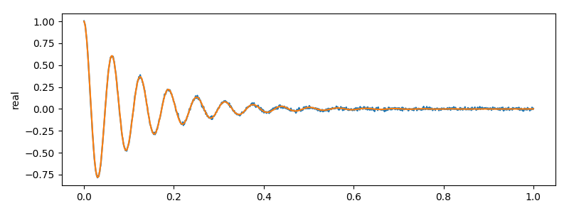
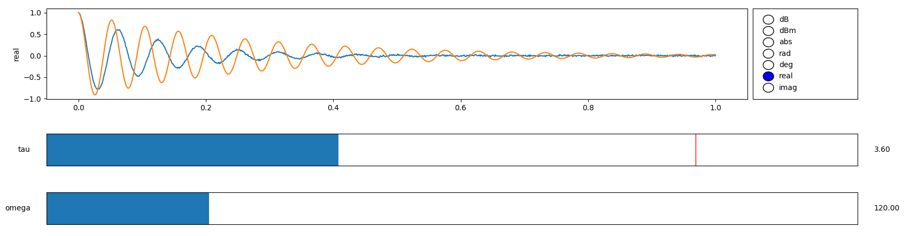
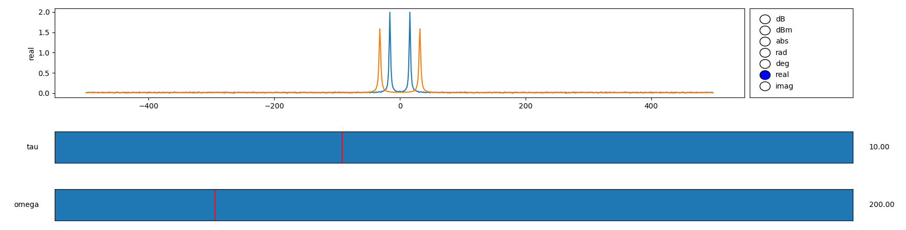
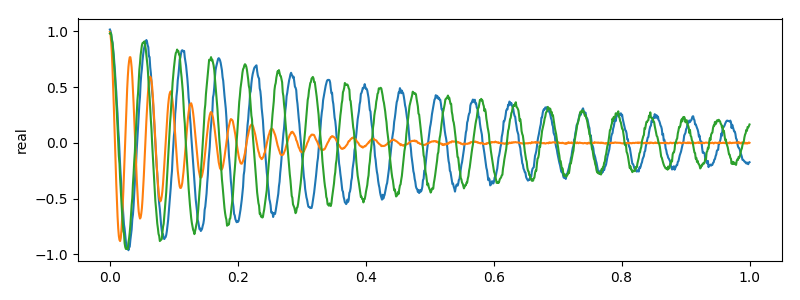
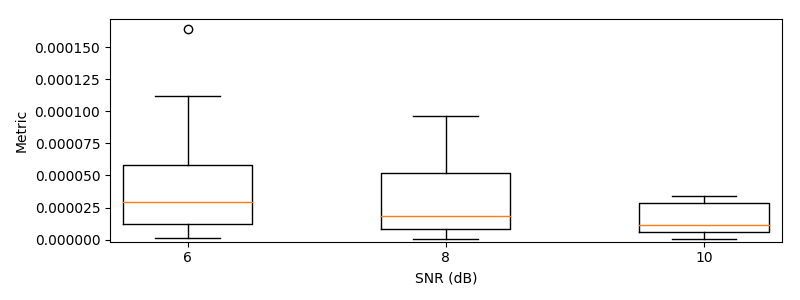

# FitKit: Fit functions to data

FitKit is a library to help with the easy fitting of 1 dimensional mathematical
functions (currently expressed using SymPy) to complex data, a problem that
commonly arises in scientific anlysis. FitKit provides a simple user interface
to `scipy.optimize` routines and also provides a GUI for manually tuning
model parameters. Additionally, the `datasheet` submodule helps users evaluate
fitting performance for different optimisation configurations for a given model.

## Basic Usage
Defining parametric models is done using SymPy. Let's construct a parametric model
containing one free variable `x` and two parameters `tau` and `omega` to model a
dampened harmonic oscillator:
```python
from sympy import *
from fitkit import *

x, tau, omega = symbols('x tau omega')
pm = Parametric1D(exp(-tau*x)*cos(omega*x), {'tau': (0, 5, 10), 'omega': (100, 150, 200)})
```
The dictionary specifies the parameter bounds and initial values. For example `tau`
is bound between 0 and 10, and is initially set to 5.

We may evaluate the parametric model for it's current parameter values at the
points `t` by calling it like a function:
```python
t = np.linspace(0, 1, 1000)

y1 = pm(t)
y1.plot()
```


To modify the parameter values we edit the values stored in the parameter vector `v`:
```python
pm.v['tau'] = 8
pm.v['omega'] = 100
y2 = pm(t)

y1.plot()
y2.plot()
```


Let's now use the model to generate some realistic experimental data:
```python
import numpy as np

y2 += np.random.normal(scale = 1e-2, size = len(y1))
y2.plot()
```


We can now fit the parametric model `pm` to the data using `pm.fit`.
```python
result = pm.fit(y2)

y2.plot()
pm(t).plot()
```


`pm.fit` gives us access to all of SciPy's local optimisers and some global
optimisers. See source code for details.

If we aren't happy with the fit or we don't want to muck around with optimizer
settings we can manually tune in the parameters. This is particulary useful for
*once-off* data analysis:
```python
sl, rd = pm.gui(t, persistent_signals = [y2])
```


We can even fit the fft:
```python
sl, rd = pm.gui(t, fft = True, persistent_signals = [y2])
```


## Evaluate Model Fitting Performance
In my line of work I develop pipelines for fitting experimental data to models on
the fly and want to choose a particular optimiser and tune it's options for
fitting performance and speed. FitKit helps you evaluate the former.

Suppose that we come up a fitting routine we like:
```python
opts = {'iters': 50, 'n': 2, 'sampling_method': 'sobol'}
result = pm.fit(y2, method = 'shgo', opts = opts)
```

FitKit can randomly sample the parameter space and inject noise according to a
signal to noise ratio (`snr`) specification:
```python
from fitkit.datasheet import *
test_cases = sample(pm, 3, t, snr = 8)

for sig1d, mdata in test_cases:
    sig1d.plot()
```


We can define a metric to measure how well we fit the frequency parameter `omega`
as a percentage of the true value:
```python
def metric(sig1d, mdata):
    fit_mdata = pm.fit(sig1d, method = 'shgo', opts = opts)
    estimated = fit_mdata.parameters['omega']
    percent = 100*np.abs(estimated - mdata['omega'])/mdata['omega']
    return percent, fit_mdata

table = apply_metric_to(sample(pm, 3, t, snr = 8), metric)
print(table.metric)
```

```
0    4.499758e-07
1    6.885015e-06
2    1.513523e-05
Name: metric, dtype: float64
```

Inspecting the performance of this metric as a function of `snr` is as simple as:
```python
table = snr_sweep(pm, t, metric, [6, 8, 10], 12)
snr_boxplot(table)
```


The plot above shows us that as our noise decreases (SNR increases) our fitting
performance improves accross all percentiles.

Developing different metrics and measuring performance as a function of noise
(or other variables in future releases) allows you to build up a datasheet for
a particular fitting algorithm.
